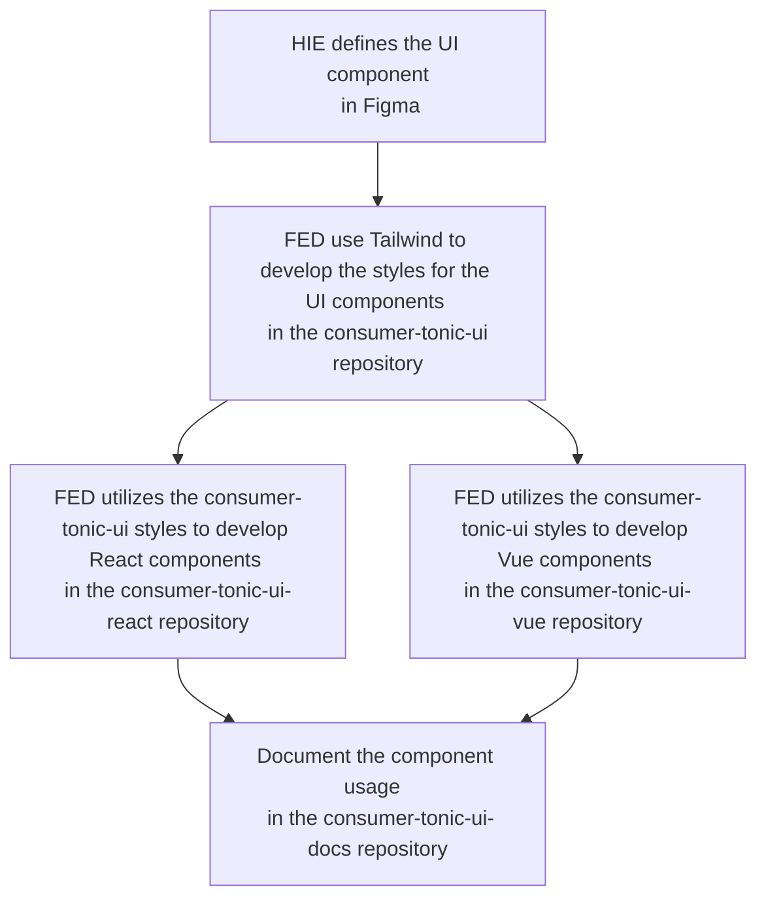
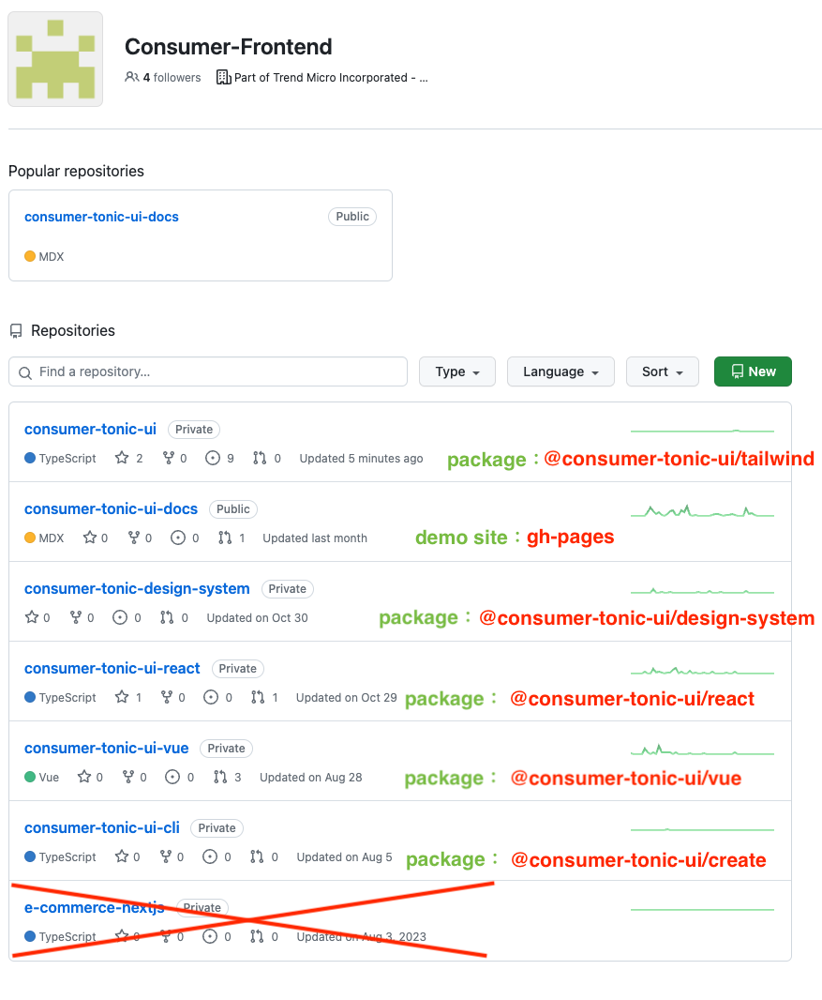

# Consumer-Tonic-UI

 This is official for Consumer-Tonic-UI , it using Tailwind plugin as base of Consumer-Tonic-UI.

 Inspired by [tailwindcss-themer](https://www.npmjs.com/package/tailwindcss-themer) & [daisyui](https://github.com/daisyui)

# HIE and RD working model


### Requirement

Nodejs version: 18 above

#### How to build

```shell
npm install # install node_modules
npm run build # build plugin to dist folder
```

Add or modify `.nested.css` file in `/src/components` folder

### How to local preview

Please clone [doc repo](https://adc.github.trendmicro.com/Consumer-Frontend/consumer-tonic-ui-docs), and change `astro/tailwind.config.cjs` file require local plugin

```diff
module.exports = {
  mode: 'jit',
  content: ['./src/**/*.{astro,html,js,jsx,md,mdx,svelte,ts,tsx,vue}'],

  // use safelist to avoid purging tonic-ui classes
  safelist: [
    ...bgColors,
    ...iconNames,
  ],

  theme: {
    extend: {},
  },
  plugins: [
    starlightPlugin(),

-   require('consumer-tonic-ui')(themerExampleConfig),
+   require('../[consumer-tonic-ui folder]/dist/index.js')(themerExampleConfig),

    // add svg to tailwind css
    addDynamicIconSelectors({
      iconSets: {
        'consumer-tonic-ui': require('consumer-tonic-ui/iconSet.json'),
      },
    })
  ],
}
```

```shell
npm install
npm run dev # run doc server
```

#### How to use

Look [Get Started](https://adc.github.trendmicro.com/pages/Consumer-Frontend/consumer-tonic-ui-docs/guides/get-started/)

## Astro Doc - Starlight

- [Official Doc](https://starlight.astro.build/getting-started/)

## Project Reference

- [github page](https://adc.github.trendmicro.com/pages/Consumer-Frontend/consumer-tonic-ui-docs/)
- [Figma - Style Guide](https://www.figma.com/file/3IUPRpbFX7r0xU9kh05fQ1/%F0%9F%8F%A0-Consumer-Tonic---Style-Guide?type=design&node-id=11029-12731&mode=design&t=r7Y1N4MpgxWa7KJI-0)
- [Figma - Component](https://www.figma.com/file/FPcYhygcr22tZS08P7hFF8/branch/br6Diik6cv6zQUvrit6RQV/%F0%9F%8F%A0-Consumer-Tonic---UI-Components?type=design&node-id=35951-10712&mode=design&t=hHYCJjNjjwdezh3K-0)

## Repos 

listing repo & library branch




## NativeWind - TailwindCss with React Native platforms

- Nativewind - css var is in unreleased v4 😭
  - https://github.com/marklawlor/nativewind/issues/600
  - https://www.nativewind.dev/v4/announcement

> we need to wait until v4 release

- [how it works](https://www.nativewind.dev/overview/how-it-works)
