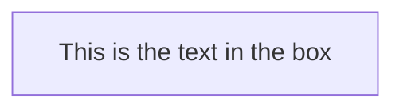
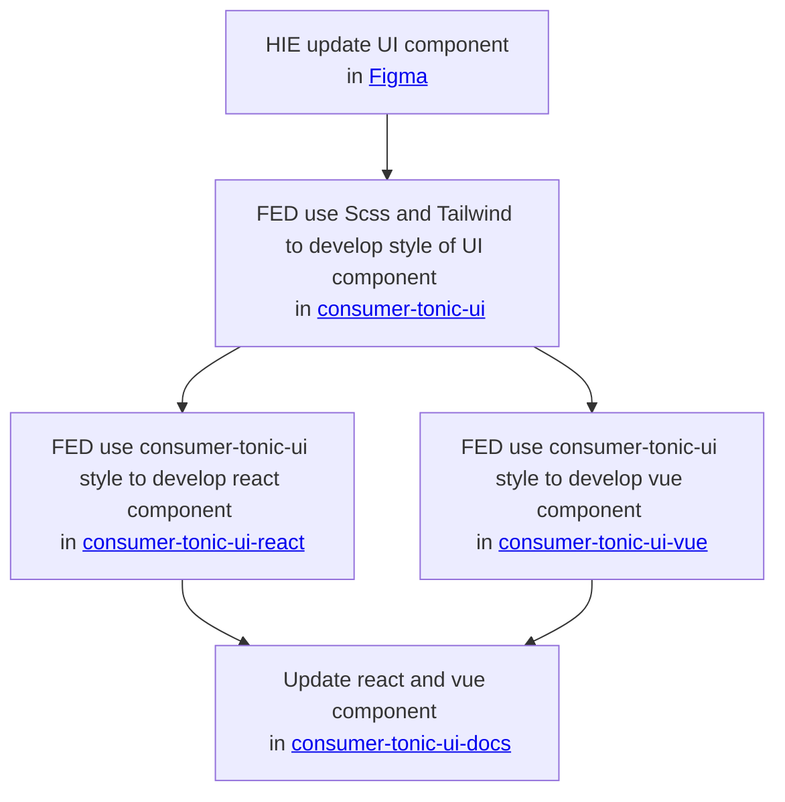
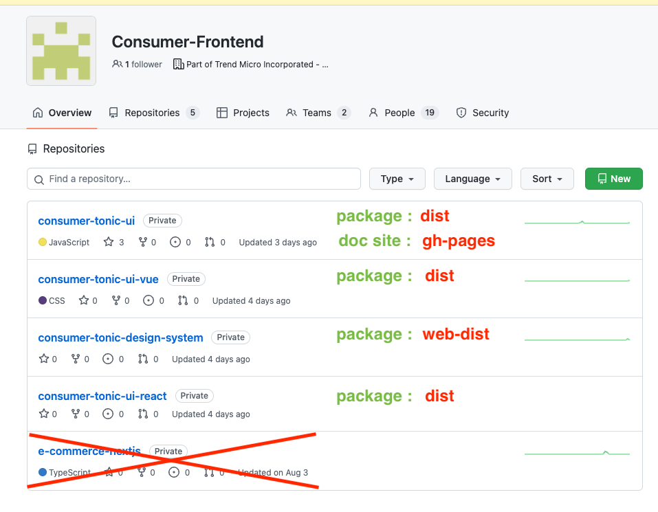

# Consumer-Tonic-UI

 This is non-official for Consumer-Tonic-UI , it's a trial for making a Tailwind plugin for Consumer-Tonic-UI.

# HIE and RD working model




#### How to develop and build

```shell
npm install && npm run install:doc # install node_modules
npm run build # build plugin to dist folder
npm run dev # run doc server
```

Add or modify `.nested.css` file in `/src/components` folder

note : you can only use nested css feature in .scss file

> Local Preview

please change `astro/tailwind.config.cjs` file require local plugin

```diff
module.exports = {
  mode: 'jit',
  content: ['./src/**/*.{astro,html,js,jsx,md,mdx,svelte,ts,tsx,vue}'],

  // use safelist to avoid purging tonic-ui classes
  safelist: [
    ...bgColors,
    ...iconNames,
  ],

  theme: {
    extend: {},
  },
  plugins: [
    starlightPlugin(),

-   require('consumer-tonic-ui')(themerExampleConfig),
+   require('../dist/index.js')(themerExampleConfig),

    // add svg to tailwind css
    addDynamicIconSelectors({
      iconSets: {
        'consumer-tonic-ui': require('consumer-tonic-ui/iconSet.json'),
      },
    })
  ],
}
```

#### How to use

Look [Get Started](https://adc.github.trendmicro.com/pages/Consumer-Frontend/consumer-tonic-ui/guides/get-started/)

## Astro Doc - Starlight

- [github page](https://adc.github.trendmicro.com/pages/Consumer-Frontend/consumer-tonic-ui/)
- [figma](https://www.figma.com/file/n5hWrEPvvmFWY9Tql47TR4/Consumer-Style-Portal-(draft)?type=design&node-id=0-1&mode=design&t=aQYapAIHNmyFgsta-0)

## Repos 

listing repo & library branch




## NativeWind - TailwindCss with React Native platforms

- Nativewind - css var is in unreleased v4 😭
  - https://github.com/marklawlor/nativewind/issues/600
  - https://www.nativewind.dev/v4/announcement

> we need to wait until v4 release

- [how it works](https://www.nativewind.dev/overview/how-it-works)
