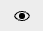

## Install

please import iconSet.json add svg to tailwind

```diff lang="js"
// tailwind.config.mjs
+ const {addDynamicIconSelectors} = require('@iconify/tailwind');
+ const iconSet = require('consumer-tonic-ui/iconSet.json');


module.exports = {
  content: ['./src/**/*.{astro,html,js,jsx,md,mdx,svelte,ts,tsx,vue}'],

  plugins: [
+    // add svg to tailwind css
+    addDynamicIconSelectors({
+      iconSets: {
+        'consumer-tonic-ui': iconSet
+      }
+    })
  ]
}
```

## How to use

in project , add class `icon-[consumer-tonic-ui --${svg_name}]` to use the existing svg

for example ,

-  16px/eye.svg = `icon-[consumer-tonic-ui--small-add]`
-  24px/eye.svg = `icon-[consumer-tonic-ui--middle-add]`
-  16px/eye.svg & red color = `text-tcsmd-ref-palette-red-70  icon-[consumer-tonic-ui--small-add]`

```html
// example.html
<!-- show icon 16px/eye.svg -->
<span class="icon-[consumer-tonic-ui--small-eye]" />

<!-- show icon 24px/eye.svg -->
<span class="icon-[consumer-tonic-ui--middle-eye]" />

<!-- change icon color -->
<span class="text-tcsmd-ref-palette-red-70 icon-[consumer-tonic-ui--small-add]" />
```

## How it work

use css `mask-image` & `background-color` to show the target icon image & colorful it

## playground

playground ( 🚧 working on )

## Search Icon

import IconPreview from '../../../components/IconPreview.vue';
import smallIconNames from 'consumer-tonic-ui/smallIconNames.json';
import middleIconNames from 'consumer-tonic-ui/middleIconNames.json';

<IconPreview
  class='relative'
  client:only="vue"
  smallIconNames={smallIconNames}
  middleIconNames={middleIconNames}
/>

## More Infos

- [antfu : icons-in-pure-css](https://antfu.me/posts/icons-in-pure-css)
- [iconify.design doc](https://iconify.design/docs/libraries/tools/import/directory.html)
