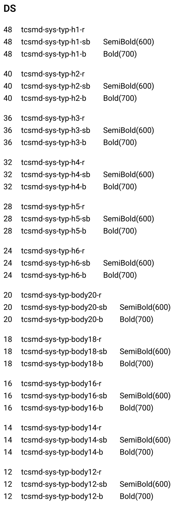

export const fontSizes = [
  'text-tcsmd-ref-typesetting-font-size-7xl',
  'text-tcsmd-ref-typesetting-font-size-6xl',
  'text-tcsmd-ref-typesetting-font-size-5xl',
  'text-tcsmd-ref-typesetting-font-size-4xl',
  'text-tcsmd-ref-typesetting-font-size-3xl',
  'text-tcsmd-ref-typesetting-font-size-2xl',
  'text-tcsmd-ref-typesetting-font-size-xl',
  'text-tcsmd-ref-typesetting-font-size-lg',
  'text-tcsmd-ref-typesetting-font-size-md',
  'text-tcsmd-ref-typesetting-font-size-sm',
  'text-tcsmd-ref-typesetting-font-size-xs',
  'tcsmd-sys-typ-h1-r',
  'tcsmd-sys-typ-h1-sb',
  'tcsmd-sys-typ-h1-b',
  'tcsmd-sys-typ-h2-r',
  'tcsmd-sys-typ-h2-sb',
  'tcsmd-sys-typ-h2-b',
  'tcsmd-sys-typ-h3-r',
  'tcsmd-sys-typ-h3-sb',
  'tcsmd-sys-typ-h3-b',
  'tcsmd-sys-typ-h4-r',
  'tcsmd-sys-typ-h4-sb',
  'tcsmd-sys-typ-h4-b',
  'tcsmd-sys-typ-h5-r',
  'tcsmd-sys-typ-h5-sb',
  'tcsmd-sys-typ-h5-b',
  'tcsmd-sys-typ-h6-r',
  'tcsmd-sys-typ-h6-sb',
  'tcsmd-sys-typ-h6-b',
  'tcsmd-sys-typ-body20-r',
  'tcsmd-sys-typ-body20-sb',
  'tcsmd-sys-typ-body20-b',
  'tcsmd-sys-typ-body18-r',
  'tcsmd-sys-typ-body18-sb',
  'tcsmd-sys-typ-body18-b',
  'tcsmd-sys-typ-body16-r',
  'tcsmd-sys-typ-body16-sb',
  'tcsmd-sys-typ-body16-b',
  'tcsmd-sys-typ-body14-r',
  'tcsmd-sys-typ-body14-sb',
  'tcsmd-sys-typ-body14-b',
  'tcsmd-sys-typ-body12-r',
  'tcsmd-sys-typ-body12-sb',
  'tcsmd-sys-typ-body12-b',
];

<main id="main" class="min-h-screen content-center p-8 not-content">
  

    {fontSizes.map(fontSize => {fontSize})}
  

</main>

### Design Token

The pre-defined tokens for Typology

| Token Name | Description | Type | Default Value |
|---|---|---|---|
| font-size-7xl | font-size | `fontSize` | 48px |
| font-size-6xl | font-size | `fontSize` | 40px |
| font-size-5xl | font-size | `fontSize` | 36px |
| font-size-4xl | font-size | `fontSize` | 32px |
| font-size-3xl | font-size | `fontSize` | 28px |
| font-size-2xl | font-size | `fontSize` | 24px |
| regular | fontWeight | `fontWeight` | 400 |
| semibold | fontWeight | `fontWeight` | 600 |
| bold | fontWeight | `fontWeight` | 700 |

- [Type setting Defined](https://universal-jasper-315.notion.site/a6f17d66474a4269bc15b3559c369c50?v=2e613ec163d44cab80dada9f796b6d0d)

