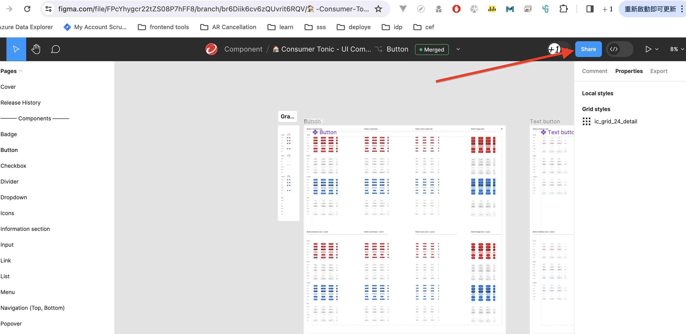
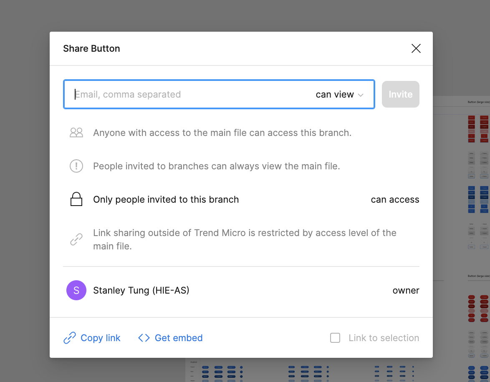
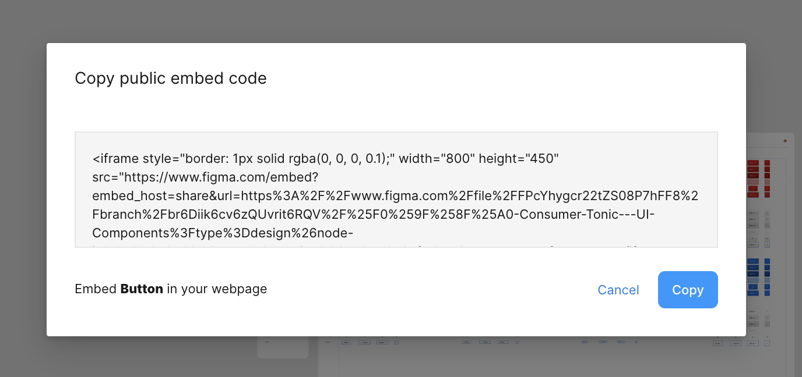

### Update Doc site

if you want to update the wording of this site ,

you can click `Edit this page` go to related .mdx file

### Add Consumer-Tonic-UI Component

you can add component .scss file in [/src/component folder](https://adc.github.trendmicro.com/Consumer-Frontend/consumer-tonic-ui/tree/dev/src/components)

which it can use nest css feature parsed by [postcss-nested](https://www.npmjs.com/package/postcss-nested)

( Note : it didn't a real scss , it only can use css-nested )

### Add Consumer-Tonic-UI Icon

add icon svg to [/src/svg folder](https://adc.github.trendmicro.com/Consumer-Frontend/consumer-tonic-ui/tree/dev/src/svg)

### Add Figma to .mdx

> In Figma using right buttons : Share > Embed > Copy

