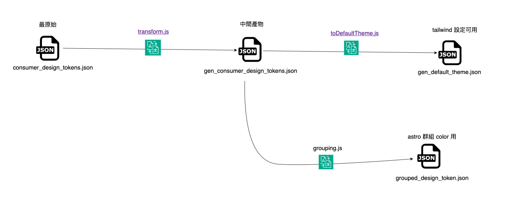
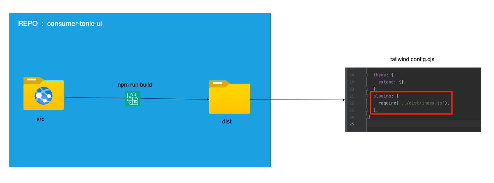

# 2023-10-19 Discussion

### What FED Plan

consumer-tonic-design-system ( JSON ) -> transform json ( github-action ) -> dist 分支 ( gen_consumer_design_tokens.json . gen_default_theme.json 這兩個 output 檔案 )

--------
consumer-tonic-ui ( vanilla-JS ) -> npm run build ( github-action )  -> dist 分支
-> npm run astro:publish ( github-action ) -> gh-pages 分支

consumer-tonic-ui-react ( react-JS ) -> dist 分支
consumer-tonic-ui-vue ( vue-JS ) -> dist 分支

### What FED Done

> Gen By Export



> Color Palettes

- Color Palettes A - https://adc.github.trendmicro.com/pages/Consumer-Frontend/consumer-tonic-ui/color/
- Color Palettes B - https://adc.github.trendmicro.com/pages/Consumer-Frontend/consumer-tonic-ui/color2/

> Class ( using tailwind , so below class are done !! )



```
bg-{COLOR_NAME}
to-{COLOR_NAME}
via-{COLOR_NAME}
from-{COLOR_NAME}
text-{COLOR_NAME}
ring-{COLOR_NAME}
fill-{COLOR_NAME}
caret-{COLOR_NAME}
stroke-{COLOR_NAME}
border-{COLOR_NAME}
divide-{COLOR_NAME}
accent-{COLOR_NAME}
shadow-{COLOR_NAME}
outline-{COLOR_NAME}
decoration-{COLOR_NAME}
placeholder-{COLOR_NAME}
ring-offset-{COLOR_NAME}
```

### Need To Confirm

- Need To Follow Below Figma : 

  1. Design Token : https://www.figma.com/file/3IUPRpbFX7r0xU9kh05fQ1/%F0%9F%8F%A0-Consumer-Tonic---Style-Guide?type=design&node-id=13-168&mode=design&t=LjpMgN6YfJAnn0Xf-0
  2. UI Component : https://www.figma.com/file/FPcYhygcr22tZS08P7hFF8/%F0%9F%8F%A0-Consumer-Tonic---UI-Components?type=design&node-id=8-0&mode=design&t=RskMEIEmOQGIAzYT-0


4. [ASK] [icons](https://www.figma.com/file/FPcYhygcr22tZS08P7hFF8/%F0%9F%8F%A0-Consumer-Tonic---UI-Components?type=design&node-id=28237-26683&mode=design&t=303QDeCHKclypmON-0)
5. [ASK] [whole page trendmicro loader - SSS EB1#V-10](https://wiki.jarvis.trendmicro.com/display/JOP/SSS+Internal+Beta+1+-+Visual+Design+Related+Report)
   - [awsmd loader](https://dribbble.com/shots/2657317-Logo-loader-animation)
   - [google loader](https://dribbble.com/shots/4971869-Google-Loader)
   - [spy-family loader](https://spy-family.net/)
   - [fpp loader](https://www.fpp.net/)
